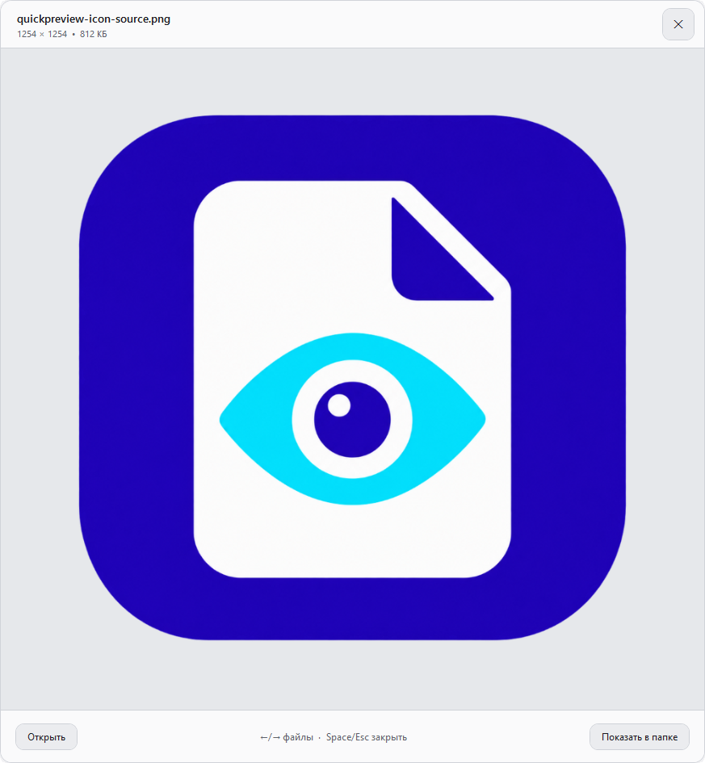
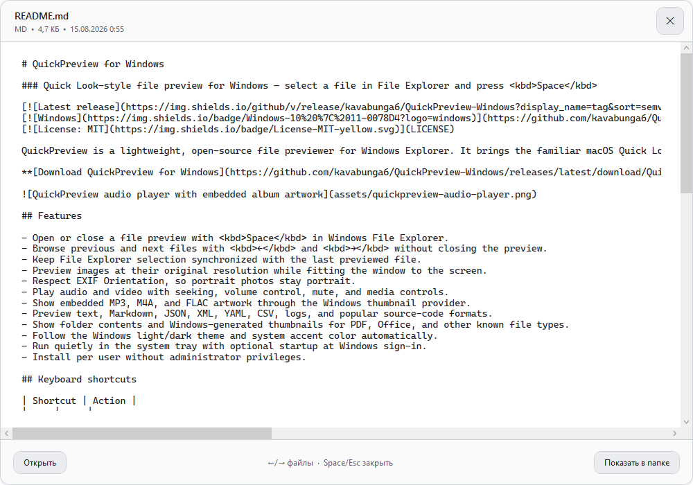
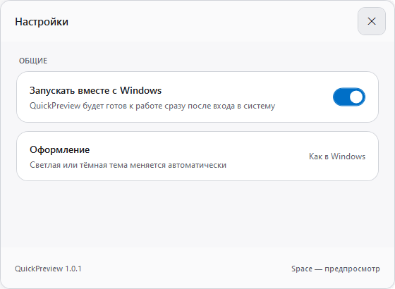

# QuickPreview for Windows

### Quick Look-style file preview for Windows — select a file in File Explorer and press <kbd>Space</kbd>

[](https://github.com/kavabunga6/QuickPreview-Windows/releases/latest)
[](https://github.com/kavabunga6/QuickPreview-Windows/releases/latest)
[](LICENSE)

QuickPreview is a lightweight, open-source file previewer for Windows Explorer. It brings the familiar macOS Quick Look workflow to Windows: highlight a file, press <kbd>Space</kbd>, and instantly preview images, videos, music, text, source code, folders, and other formats supported by Windows.

**[Download QuickPreview for Windows](https://github.com/kavabunga6/QuickPreview-Windows/releases/latest/download/QuickPreview-Setup.exe)**

<p align="center">
  
</p>

## Features

- Open or close a file preview with <kbd>Space</kbd> in Windows File Explorer.
- Browse previous and next files with <kbd>←</kbd> and <kbd>→</kbd> without closing the preview.
- Keep File Explorer selection synchronized with the last previewed file.
- Preview images at their original resolution while fitting the window to the screen.
- Respect EXIF Orientation, so portrait photos stay portrait.
- Play audio and video with seeking, volume control, mute, and media controls.
- Show embedded MP3, M4A, and FLAC artwork through the Windows thumbnail provider.
- Preview text, Markdown, YAML, CSV, logs, and popular source-code formats.
- Pretty-print valid JSON and XML while keeping malformed documents available as raw text.
- Read PDF documents interactively with page navigation, scrolling, zoom, search, and printing.
- Show folder contents and Windows-generated thumbnails for Office and other known file types.
- Follow the Windows light/dark theme and system accent color automatically.
- Run quietly in the system tray with optional startup at Windows sign-in.
- Install per user without administrator privileges.

## Screenshots

<table>
  <tr>
    <th>Text and source-code preview</th>
    <th>Settings and Windows startup</th>
  </tr>
  <tr>
    <td></td>
    <td></td>
  </tr>
</table>

## Keyboard shortcuts

| Shortcut | Action |
| --- | --- |
| <kbd>Space</kbd> | Open or close preview |
| <kbd>←</kbd> / <kbd>→</kbd> | Previous or next file |
| <kbd>Esc</kbd> | Close preview |
| <kbd>Enter</kbd> | Open the current file |
| <kbd>Ctrl</kbd>+<kbd>Shift</kbd>+<kbd>E</kbd> | Show the current file in Explorer |

## Installation

1. Download **QuickPreview-Setup.exe** from the [latest release](https://github.com/kavabunga6/QuickPreview-Windows/releases/latest).
2. Run the installer. Administrator rights are not required.
3. Select a file in File Explorer and press <kbd>Space</kbd>.

The installer adds QuickPreview to the Start menu and Windows Installed Apps. It also includes a standard uninstaller. The release is self-contained, so a separate .NET installation is not required.

### What is new in 1.1.0

PDF documents now open in an interactive embedded viewer. JSON and XML files are automatically formatted for readability, with the original source preserved when a document is malformed.

## Settings and startup

Double-click the QuickPreview tray icon, or right-click it and choose **Settings**. The settings window includes an option to launch QuickPreview automatically when you sign in to Windows. The interface follows the active Windows theme.

## Build from source

Requirements:

- Windows 10 or 11, x64
- [.NET 6 SDK](https://dotnet.microsoft.com/download/dotnet/6.0)
- [Inno Setup 6](https://jrsoftware.org/isinfo.php) for building the installer

```powershell
dotnet build -c Release
powershell.exe -NoProfile -ExecutionPolicy Bypass -File .\installer\build-installer.ps1
```

The self-contained installer is written to `artifacts\QuickPreview-Setup.exe`.

## Notes

- Available video formats depend on media codecs installed in Windows.
- Interactive PDF preview uses the Microsoft Edge WebView2 Runtime included with current Windows and Microsoft Edge installations. If the runtime is unavailable, QuickPreview falls back to the Windows system thumbnail.
- Interactive Office rendering is not bundled; QuickPreview uses the system thumbnail when Windows provides one.
- The global <kbd>Space</kbd> shortcut currently targets File Explorer windows.

## Русский

QuickPreview — открытый просмотрщик файлов для Windows в стиле Quick Look на macOS. Выделите файл в Проводнике и нажмите <kbd>Space</kbd>: приложение покажет фото, видео, музыку, текст, исходный код, содержимое папок и системные эскизы других форматов.

Настройки открываются двойным щелчком по значку в трее. Там можно включить запуск вместе с Windows. Установщик работает без прав администратора, добавляет ярлык в меню «Пуск» и штатное удаление через список установленных приложений.

## License

QuickPreview is released under the [MIT License](LICENSE).
